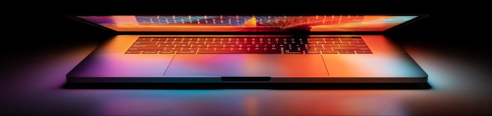

# Strategic Engineering for Zero Comprehension Debt

With 20+ years of experience architecting high-load Laravel platforms, I provide something increasingly rare: **Technical Autonomy**. I deliver <ins>human-authored, fully auditable code</ins> designed for regulated environments where "* *the AI suggested it* *" is not a valid control. Every line I ship is a deliberate human judgment call I am prepared to defend in an audit or a 3:00 AM production incident.

While I have deep experience integrating LLMs into products, I do not use them to write your core logic. I offer the security of <ins>human-verified architecture</ins> with a commitment to **total code traceability** that avoids the three-fold increase in vulnerabilities found in AI-assisted code, ensuring your system's foundation is built on 20 years of expertise, not a language model's guess.

